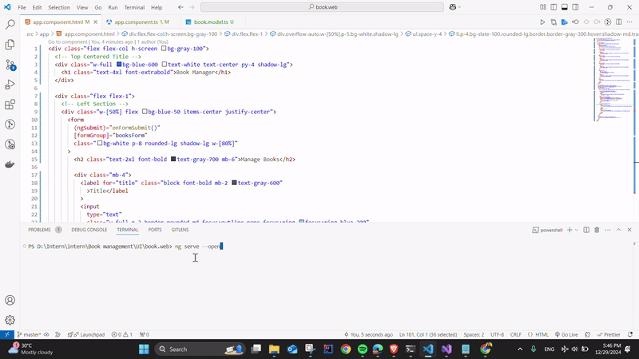

# Book Management Application

This project is a simple web application that allows users to manage a list of books. Users can add, view, update, and delete books through a user-friendly interface. The application consists of a frontend built with Angular and a backend implemented in ASP.NET with C#.

---

## Features

### Frontend (Angular)
- **Display Book List**: View a list of all books.
- **Add Book**: Fill out a form to add a new book.
- **Edit Book**: Update details of an existing book.
- **Delete Book**: Remove a book from the list.

### Backend (ASP.NET with C#)
- RESTful API for handling CRUD operations:
  - **Create**: Add a new book.
  - **Read**: Retrieve the list of books.
  - **Update**: Modify details of an existing book.
  - **Delete**: Remove a book from the list.
- In-memory list to store book data.

---

## Book Model
The `Book` model includes the following properties:
- `id` (int): Unique identifier for each book.
- `title` (string): Title of the book.
- `author` (string): Author of the book.
- `isbn` (string): ISBN number of the book.
- `publicationDate` (DateTime): Publication date of the book.

---

## Technologies Used
- **Frontend**:
  - Angular
  - HTML, CSS, JavaScript
- **Backend**:
  - ASP.NET Core
  - C#

---

## Demonstration Video
A demonstration of the project can be found at the following link:  
[Project Video](https://drive.google.com/drive/folders/1cDPE7lLfP2mI90bgGwC-zHoayRK3Vk1D?usp=sharing)
